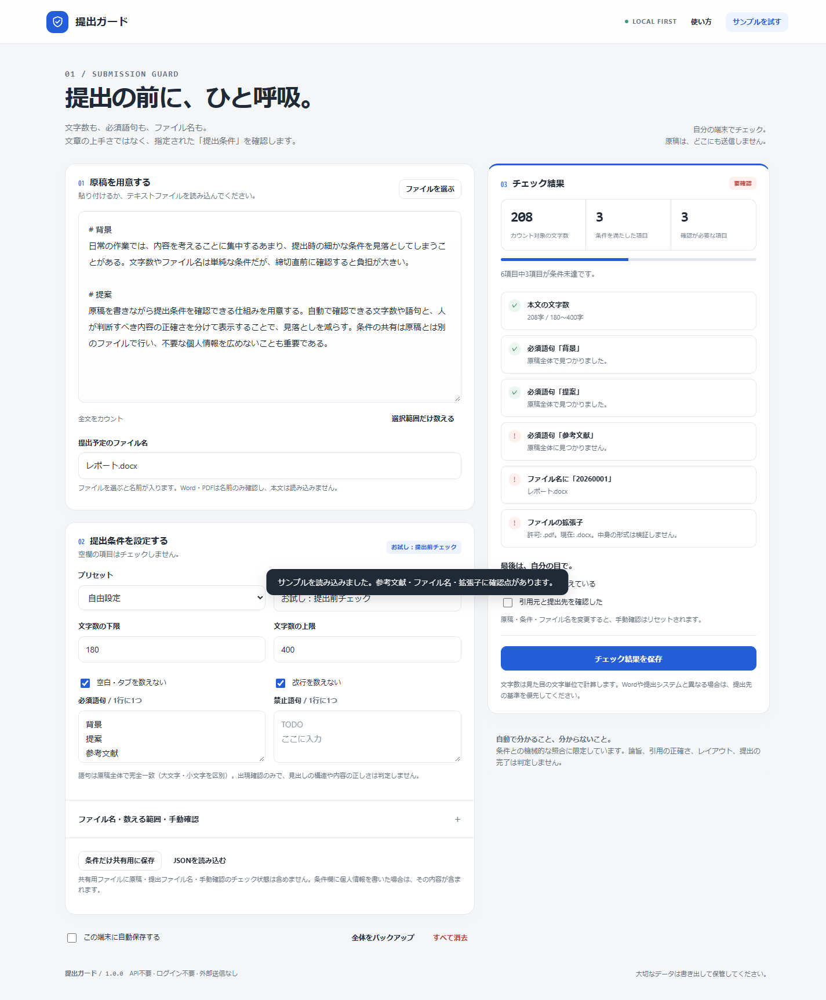

# 提出ガード

文章の「上手さ」ではなく、提出先の条件との一致を確認する、日本語向けのローカルWebアプリです。原稿は端末内で処理し、文章を含まない条件セットを別ファイルで共有できます。

**外部サービスのAPI不要 · ログイン不要 · 有料サーバー不要 · ビルド不要**



**[ブラウザで開く](https://masanori-spec.github.io/teishutsu-guard/)** · [ソースコード](https://github.com/Masanori-Spec/teishutsu-guard)

## できること

- 原稿の貼り付け・テキスト読み込みと、文字数のリアルタイム照合。
- 下限・上限、空白・改行の数え方、Markdown見出し・参考文献の除外、選択範囲のみのカウント。
- 必須語句・禁止語句、ファイル名に必要な文字列、拡張子の確認。
- 自動照合と、人が確認する項目を分離。原稿・ファイル名・条件の変更で手動確認をリセット。
- 原稿を含めない条件セットJSON、原稿を含むバックアップJSON、チェック結果Markdownの書き出し。
- 任意の端末内自動保存。別タブの変更・保存容量不足を検知して上書きを停止。

## 使い方

1. 「サンプルを試す」で、未達の条件が表示されることを確認します。
2. 自分の原稿を貼り付け、提出条件とファイル名を設定します。Word・PDFの本文は読み込みません。
3. 結果を確認して修正します。自動照合がOKでも、内容・引用・提出先は自分で確認してください。
4. 他の人に条件を渡すときは「条件だけ保存」を使います。原稿も保存するときはバックアップを使います。

## ローカルで起動

HTML / CSS / JavaScriptだけの静的アプリです。アプリ実行にNode.jsやパッケージのインストールは必要ありません。各ファイルを同じ配置で静的配信してください。

Pythonがある環境では、このディレクトリで次を実行します。これは自分の端末内のみに公開する開発用サーバーです。

```sh
python -m http.server 8080 --bind 127.0.0.1
```

ブラウザで `http://127.0.0.1:8080/` を開きます。サーバーは Ctrl+C で停止します。別の静的配信ツールも使えます。GitHub公開用の入口はルートの `index.html` です。

## 保存とプライバシー

アプリ本体には、入力した原稿・画像・記録を送信する処理、有料API、解析タグ、外部CDN、外部フォントを組み込んでいません。公開サイトを開く際の配信サーバーへのアクセスは別です。

端末内保存はクラウドバックアップではありません。ブラウザデータの削除や端末の紛失に備え、重要な内容はJSONで保管してください。共用端末では保存をオフにします。「ここ直して」は画像の自動保存を行いません。

条件セット以外の書き出しファイルには、入力内容・ファイル名・画像・参照情報が入る場合があります。共有する前に中身を確認してください。端末やブラウザ拡張機能の安全性まで保証するものではありません。

## 対応していないこと・制限

- 内容採点、事実確認、盗用検出、引用形式の意味理解は行いません。
- Word・PDFはファイル名のみ確認します。本文の抽出・ページ数・余白・フォントの検査はありません。
- 必須／禁止語句は原稿全体の部分一致（大文字小文字を区別）です。選択範囲や文字数除外の設定は、この語句照合には影響しません。
- 「見出しを除外」は `# 見出し` 形式のMarkdown見出しが対象です。「参考文献を除外」は行全体が「参考文献」「引用文献」「References」に一致する見出し以降を除きます。
- 文字数はNFC正規化後の書記素単位です。`Intl.Segmenter` 非対応環境ではコードポイント数にフォールバックします。提出先のカウント方式と一致する保証はありません。
- 原稿は100万UTF-16コード単位、条件は各100件まで。JSON読み込みは2MiBまでです。

## 開発とテスト

Node.js v22.16.0およびWindowsのv24.21.0で検証しました。ランタイム依存パッケージはありません。

```sh
node --test tests/core.test.cjs
# または npm test（npm install は不要）
```

判定ロジック **39件**、ChromiumのDOMテスト **20件** が通過しています。表示は320 / 375 / 768 / 1440px幅を検査しています。

DOMテストは保存・書き出しを代替するハーネスです。これとは別に、WindowsのEdgeで実際のローカルHTTP配信と公開GitHub Pagesにアクセスし、それぞれ16件の追加検証に成功しました。実際のファイル書き出し、サンプル操作、各画面幅、配信エラーの有無を確認しています。実端末Safari・クリップボード権限UIなどは未検証です。詳細は [DOM検証記録](docs/TESTING.md) と [公開URLの検証記録](docs/PUBLICATION.md) を参照してください。

## 構成

```text
index.html           画面・アクセシビリティの基本構造
shared.css / app.css 共通と個別のスタイル
common.js            入出力・通知などのローカル処理
core.js              DOMに依存しない判定ロジック
app.js               UIと判定・保存の接続
tests/               単体テストとDOMテスト
docs/                検証記録とスクリーンショット
```

## 公開状況

GitHub Pagesで公開する、ビルド不要の静的Webアプリです。公開元は `main` ブランチのルートです。認証情報や自動投稿スクリプトは含みません。

公開URL: https://masanori-spec.github.io/teishutsu-guard/

## ライセンス

[MIT](LICENSE)
